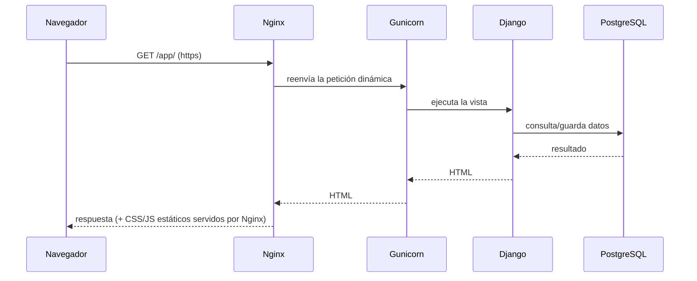

# 🚀 DESPLIEGUE.md — Cómo montar Estibapp paso a paso

Guía pensada para alguien que **nunca** ha desplegado una aplicación. Se explica
desde cero qué es cada pieza y se entregan **tres caminos** de montaje:

- **Opción A — Otro computador con Docker** (la más simple, recomendada para empezar).
- **Opción B — Seenode (PaaS)**: subes el repo y la plataforma lo levanta.
- **Opción C — DigitalOcean (VPS/Droplet)**: un servidor propio en internet con dominio y HTTPS.

---

## 0. Conceptos en 2 minutos

| Pieza | ¿Qué es? | Analogía |
|-------|----------|----------|
| **Django** | El framework donde está escrita la app (Python). | El motor del auto. |
| **Gunicorn** | El "servidor de aplicación" que ejecuta Django para muchos usuarios a la vez. | La transmisión que entrega la potencia del motor a las ruedas. |
| **Nginx** | El "servidor web" que recibe las visitas de internet, sirve imágenes/CSS y reparte el tráfico a Gunicorn. | El portero/recepcionista que ordena quién entra. |
| **PostgreSQL** | La base de datos donde se guardan ETAs, clientes, etc. | El archivador con todos los documentos. |
| **Docker** | Empaqueta todo lo anterior en "cajas" (contenedores) que funcionan igual en cualquier computador. | Un contenedor marítimo: lo armas una vez y viaja idéntico. |
| **Docker Compose** | Coordina varias cajas juntas (db + web + nginx) con un solo comando. | El plano que dice cómo se apilan los contenedores. |

**Flujo de una visita** (qué pasa cuando alguien abre la app):



> En **Estibapp** los tres servicios (db, web=Django+Gunicorn, nginx) ya están
> definidos en `docker-compose.yml`. No tienes que instalarlos a mano.

---

## 1. Requisitos previos (todas las opciones)

1. Tener el código de Estibapp (esta carpeta `APP/`).
2. Para A y C: **Docker Desktop** (Windows/Mac) o **Docker Engine + Compose** (Linux).
   - Descarga: https://www.docker.com/products/docker-desktop/
   - Verifica que quedó instalado:
     ```powershell
     docker --version
     docker compose version
     ```
3. Un editor de texto para crear el archivo `.env` (Bloc de notas sirve).

---

## 2. Crear el archivo `.env` (configuración secreta)

En la raíz de `APP/` hay un `.env.example`. **Cópialo** a `.env` y edita los valores.

En Windows PowerShell:
```powershell
Copy-Item .env.example .env
```

Abre `.env` y deja algo así (cambia las contraseñas):

```dotenv
# Entorno: prod = producción (seguro), dev = desarrollo local
DJANGO_ENV=prod

# Clave secreta de Django: pon una cadena larga y aleatoria
DJANGO_SECRET_KEY=cambia-esto-por-una-cadena-larga-y-unica-1234567890

# Dominios/host autorizados (separados por coma). Para pruebas locales:
DJANGO_ALLOWED_HOSTS=localhost,127.0.0.1

# Base de datos PostgreSQL
POSTGRES_DB=estibapp
POSTGRES_USER=estiba
POSTGRES_PASSWORD=pon-una-clave-segura
POSTGRES_HOST=db
POSTGRES_PORT=5432
```

> 🔐 **Nunca** subas el archivo `.env` a Git. Ya está ignorado en `.gitignore`.
>
> Para generar una `SECRET_KEY` segura:
> ```powershell
> $env:PYTHONPATH=""; .\.venv\Scripts\python.exe -c "from django.core.management.utils import get_random_secret_key; print(get_random_secret_key())"
> ```

---

## 3. OPCIÓN A — Montar en otro computador con Docker (recomendada)

Esta es la forma más rápida de tener Estibapp funcionando en cualquier PC.

### Paso 1 — Copiar el proyecto
Copia toda la carpeta `APP/` al otro computador (USB, red, o `git clone`).

### Paso 2 — Crear el `.env`
Sigue el punto 2 de arriba en ese computador.

### Paso 3 — Levantar todo con un comando
Desde la carpeta `APP/`:
```powershell
docker compose up --build -d
```
- `--build` construye las imágenes la primera vez.
- `-d` lo deja corriendo en segundo plano.

Esto levanta 3 contenedores: **db**, **web** y **nginx**. El `entrypoint.sh`
espera a la base de datos, aplica migraciones y recolecta archivos estáticos
automáticamente.

### Paso 4 — Crear el usuario administrador
```powershell
docker compose exec web python manage.py createsuperuser
```
Te pedirá usuario, email y contraseña. Este usuario es **superusuario** (ve todo).

### Paso 5 — Abrir la app
- App: http://localhost/app/
- Login: http://localhost/login/
- Admin Django: http://localhost/admin/

### Paso 6 — Asignar roles a los usuarios
Los roles se manejan con **Grupos** de Django (ya creados por la migración):
`Administrador`, `Coordinador`, `Encargado de Patio`.

1. Entra a http://localhost/admin/ con el superusuario.
2. Ve a **Usuarios → (crea o edita un usuario)**.
3. En **Groups**, asígnale uno de los tres grupos.
4. Guarda. Ese usuario verá solo lo que su rol permite.

### Comandos útiles
```powershell
docker compose ps             # ver estado de los contenedores
docker compose logs -f web    # ver registros de la app en vivo
docker compose down           # detener todo (los datos se conservan)
docker compose down -v        # detener y BORRAR la base de datos (¡cuidado!)
docker compose up --build -d  # reconstruir tras cambios de código
```

---

## 4. OPCIÓN B — Seenode (PaaS, sin administrar servidor)

Seenode (https://seenode.com) es una plataforma que toma tu repositorio y lo
levanta por ti. Tú no administras Nginx ni el sistema operativo.

### Pasos
1. Sube el proyecto a un repositorio Git (GitHub/GitLab).
2. Crea una cuenta en Seenode y conecta el repositorio.
3. Crea un **servicio Web** apuntando a este proyecto:
   - **Build/Run**: la plataforma detecta `requirements.txt` y el `Dockerfile`.
     Si usa el Dockerfile, el arranque ya queda definido por `entrypoint.sh`.
   - **Comando de arranque** (si te lo pide explícitamente):
     ```
     gunicorn config.wsgi:application --bind 0.0.0.0:$PORT
     ```
4. Crea un **add-on de PostgreSQL** en Seenode. Te dará credenciales.
5. Define las **variables de entorno** del servicio (las mismas del `.env`):
   `DJANGO_ENV=prod`, `DJANGO_SECRET_KEY`, `DJANGO_ALLOWED_HOSTS=tu-dominio.seenode.app`,
   y las `POSTGRES_*` que entregó el add-on (`POSTGRES_HOST` será el host del add-on,
   no `db`).
6. La primera vez, ejecuta migraciones y crea el superusuario desde la consola
   web de Seenode:
   ```
   python manage.py migrate
   python manage.py createsuperuser
   python manage.py collectstatic --noinput
   ```
7. Abre la URL pública que te asigna Seenode.

> En PaaS no necesitas el contenedor de Nginx propio: la plataforma pone su
> propio proxy/HTTPS delante. WhiteNoise (ya incluido) sirve los estáticos.

---

## 5. OPCIÓN C — DigitalOcean (servidor propio con dominio y HTTPS)

Para cuando quieres un servidor en internet, con tu dominio y candado HTTPS.
Usaremos un **Droplet** (máquina virtual Linux) + Docker.

### Paso 1 — Crear el Droplet
1. Crea cuenta en https://www.digitalocean.com
2. **Create → Droplets**:
   - Imagen: **Ubuntu 24.04 LTS**.
   - Plan: **Basic**, 2 GB RAM mínimo recomendado.
   - Autenticación: **SSH key** (más segura que contraseña).
3. Anota la **IP pública** del Droplet.

### Paso 2 — Apuntar tu dominio
En tu proveedor de dominio crea un registro **A**:
```
tipo: A    nombre: @ (o app)    valor: <IP del Droplet>
```
Espera unos minutos a que propague.

### Paso 3 — Entrar al servidor e instalar Docker
```bash
ssh root@<IP del Droplet>

# Instalar Docker + Compose
curl -fsSL https://get.docker.com | sh
```

### Paso 4 — Subir el proyecto
Desde tu PC (o clonando con Git en el servidor):
```bash
# opción git:
git clone <url-del-repo> estibapp
cd estibapp
```

### Paso 5 — Crear el `.env` de producción
```bash
cp .env.example .env
nano .env
```
Pon `DJANGO_ENV=prod`, una `DJANGO_SECRET_KEY` larga y
`DJANGO_ALLOWED_HOSTS=tu-dominio.com,www.tu-dominio.com`.

### Paso 6 — Levantar la app
```bash
docker compose up --build -d
docker compose exec web python manage.py createsuperuser
```
Ya responde en `http://tu-dominio.com/app/`.

### Paso 7 — Activar HTTPS (candado verde)
La forma más simple es poner **Caddy** o **Nginx + Certbot** delante. Con
Certbot sobre el Nginx del servidor:
```bash
sudo apt install certbot python3-certbot-nginx -y
sudo certbot --nginx -d tu-dominio.com -d www.tu-dominio.com
```
Certbot obtiene el certificado de Let's Encrypt y configura la redirección a HTTPS.

> Alternativa moderna: usar **Caddy** como proxy, que gestiona HTTPS solo.

### Paso 8 — Mantenimiento
```bash
docker compose logs -f web        # ver logs
git pull && docker compose up --build -d   # actualizar tras nuevos cambios
```

---

## 6. Lista de verificación post-despliegue

- [ ] `http://<host>/app/` carga el dashboard tras iniciar sesión.
- [ ] El superusuario puede entrar al admin (`/admin/`).
- [ ] Existen los grupos `Administrador`, `Coordinador`, `Encargado de Patio`.
- [ ] Un usuario de cada rol ve solo su menú correspondiente.
- [ ] Se puede crear un cliente, un contenedor y una ETA.
- [ ] El botón **Avanzar** mueve la ETA de estado y registra el movimiento.
- [ ] Los reportes exportan CSV (se abre bien en Excel, con acentos).
- [ ] En producción (`DJANGO_ENV=prod`) el sitio va por HTTPS.

---

## 7. Problemas frecuentes

| Síntoma | Causa probable | Solución |
|---------|----------------|----------|
| `Bad Request (400)` | El dominio no está en `DJANGO_ALLOWED_HOSTS`. | Agrégalo en `.env` y `docker compose up -d`. |
| La página se ve sin estilos | Faltó `collectstatic`. | `docker compose exec web python manage.py collectstatic --noinput`. |
| `could not translate host name "db"` | Estás corriendo fuera de Docker. | Dentro de Docker el host es `db`; fuera, usa `localhost`. |
| No puedo entrar | El usuario no tiene grupo. | Asigna un grupo en `/admin/`. |
| Cambié código y no se ve | La imagen es vieja. | `docker compose up --build -d`. |

---

## 8. Modo DEBUG y páginas de error (404, 500…)

Django tiene dos modos, controlados por `DEBUG`:

| `DEBUG` | Para qué sirve | Qué muestra ante un error |
|---------|----------------|---------------------------|
| `True`  | **Desarrollo**. Recarga sola, errores detallados. | Pantalla amarilla técnica de Django (útil para programar). |
| `False` | **Producción / vista real**. | Las páginas con estilo del proyecto: `templates/404.html`, etc. |

> En desarrollo (`config/settings/dev.py`) `DEBUG=True`, por eso ves la pantalla
> amarilla y **no** la página 404 personalizada. La 404 de marca solo aparece con
> `DEBUG=False` (que es lo normal en producción, `config/settings/prod.py`).

**Ver las páginas de error con su estilo real en local (temporal):**

```powershell
# 1. Poner DEBUG=False en config/settings/dev.py  (DEBUG = False)
# 2. Recolectar estáticos (obligatorio con DEBUG=False):
docker compose exec web python manage.py collectstatic --noinput
docker compose restart web
# 3. Abrir una ruta inexistente, p. ej. http://localhost/no-existe
```

**Volver a desarrollo:** reponer `DEBUG = True` en `config/settings/dev.py` (runserver
recarga solo). En este modo `runserver` vuelve a servir los estáticos automáticamente.

> La página 404 (`templates/404.html`) usa CSS por CDN y un botón **Volver al ingreso**,
> por lo que se ve aunque no se haya hecho `collectstatic`.

---

**Resumen de un vistazo (Opción A):**
```powershell
Copy-Item .env.example .env      # 1. configurar
# editar .env (SECRET_KEY, ALLOWED_HOSTS, contraseñas)
docker compose up --build -d     # 2. levantar
docker compose exec web python manage.py createsuperuser   # 3. admin
# abrir http://localhost/app/
```
