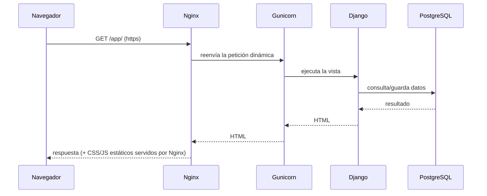

# 🚀 DESPLIEGUE.md — Montaje y operación de Estibapp

Guía pensada para alguien que **nunca** ha desplegado una aplicación. Se explica
desde cero qué es cada pieza y se entregan **tres caminos** de montaje:

- **Opción A — Otro computador con Docker** (la más simple, recomendada para empezar).
- **Opción B — Seenode (PaaS)**: subes el repo y la plataforma lo levanta.
- **Opción C — DigitalOcean (VPS/Droplet)**: servidor propio en internet con dominio y HTTPS.

---

## 0. Conceptos en 2 minutos

| Pieza | ¿Qué es? | Analogía |
|-------|----------|----------|
| **Django** | El framework donde está escrita la app (Python). | El motor del auto. |
| **Gunicorn** | El "servidor de aplicación" que ejecuta Django para muchos usuarios a la vez. | La transmisión que entrega la potencia del motor a las ruedas. |
| **Nginx** | El "servidor web" que recibe las visitas de internet, sirve imágenes/CSS y reparte el tráfico a Gunicorn. | El portero/recepcionista que ordena quién entra. |
| **PostgreSQL** | La base de datos donde se guardan ETAs, clientes, etc. | El archivador con todos los documentos. |
| **Docker** | Empaqueta todo lo anterior en "cajas" (contenedores) que funcionan igual en cualquier computador. | Un contenedor marítimo: lo armas una vez y viaja idéntico. |
| **Docker Compose** | Coordina varias cajas juntas (db + web + nginx) con un solo comando. | El plano que dice cómo se apilan los contenedores. |

**Flujo de una visita** (qué pasa cuando alguien abre la app):



> En **Estibapp** los tres servicios (db, web=Django+Gunicorn, nginx) ya están
> definidos en `docker-compose.yml`. No tienes que instalarlos a mano.

---

## 1. Requisitos previos (todas las opciones)

1. Tener el código de Estibapp (esta carpeta `APP/`).
2. Para A y C: **Docker Desktop** (Windows/Mac) o **Docker Engine + Compose** (Linux).
   - Descarga: https://www.docker.com/products/docker-desktop/
   - Verifica que quedó instalado:
     ```powershell
     docker --version
     docker compose version
     ```
3. Un editor de texto para crear el archivo `.env` (Bloc de notas sirve).

---

## 2. Crear el archivo `.env` (configuración secreta)

En la raíz de `APP/` hay un `.env.example`. **Cópialo** a `.env` y edita los valores.

En Windows PowerShell:
```powershell
Copy-Item .env.example .env
```

Abre `.env` y deja algo así (cambia las contraseñas):

```dotenv
# Entorno: prod = producción (seguro), dev = desarrollo local
DJANGO_ENV=prod

# Clave secreta de Django: pon una cadena larga y aleatoria
DJANGO_SECRET_KEY=cambia-esto-por-una-cadena-larga-y-unica-1234567890

# Dominios/host autorizados (separados por coma). Para pruebas locales:
DJANGO_ALLOWED_HOSTS=localhost,127.0.0.1

# Base de datos PostgreSQL
POSTGRES_DB=estibapp
POSTGRES_USER=estiba
POSTGRES_PASSWORD=pon-una-clave-segura
POSTGRES_HOST=db
POSTGRES_PORT=5432
```

> 🔐 **Nunca** subas el archivo `.env` a Git. Ya está ignorado en `.gitignore`.
>
> Para generar una `SECRET_KEY` segura:
> ```powershell
> $env:PYTHONPATH=""; .\.venv\Scripts\python.exe -c "from django.core.management.utils import get_random_secret_key; print(get_random_secret_key())"
> ```

---

## 3. OPCIÓN A — Montar en otro computador con Docker (recomendada)

Esta es la forma más rápida de tener Estibapp funcionando en cualquier PC.

### Paso 1 — Copiar el proyecto
Copia toda la carpeta `APP/` al otro computador (USB, red, o `git clone`).

### Paso 2 — Crear el `.env`
Sigue el punto 2 de arriba en ese computador.

### Paso 3 — Levantar todo con un comando
Desde la carpeta `APP/`:
```powershell
docker compose up --build -d
```
- `--build` construye las imágenes la primera vez.
- `-d` lo deja corriendo en segundo plano.

Esto levanta 3 contenedores: **db**, **web** y **nginx**. El `entrypoint.sh`
espera a la base de datos, aplica migraciones y recolecta archivos estáticos
automáticamente.

**Volúmenes de Docker** (el "almacenaje" que no hay que encender manualmente):

| Volumen | Para qué sirve | Persiste al apagar |
|---------|---------------|-------------------|
| `postgres_data` | Base de datos PostgreSQL (clientes, ETAs, etc.) | **Sí** |
| `static_volume` | Archivos estáticos (CSS/JS) que sirve Nginx | Sí |
| `media_volume`  | Archivos subidos por usuarios | Sí |

Solo se borran si ejecutas `docker compose down -v` (la `-v` elimina los volúmenes).

### Paso 4 — Crear el usuario administrador
```powershell
docker compose exec web python manage.py createsuperuser
```
Te pedirá usuario, email y contraseña. Este usuario es **superusuario** (ve todo).

### Paso 5 — Abrir la app
- App: http://localhost/app/
- Login: http://localhost/login/
- Admin Django: http://localhost/admin/

### Paso 6 — Asignar roles a los usuarios
Los roles se manejan con **Grupos** de Django (ya creados por la migración):
`Administrador`, `Coordinador`, `Encargado de Patio`.

1. Entra a http://localhost/admin/ con el superusuario.
2. Ve a **Usuarios → (crea o edita un usuario)**.
3. En **Groups**, asígnale uno de los tres grupos.
4. Guarda. Ese usuario verá solo lo que su rol permite.

### Comandos del día a día
```powershell
docker compose ps                    # ver estado de los contenedores
docker compose logs -f web           # ver registros de la app en vivo
docker compose down                  # detener todo (los datos se conservan)
docker compose down -v               # detener y BORRAR la base de datos (¡cuidado!)
docker compose up --build -d         # reconstruir tras cambios de código
docker compose exec web python manage.py migrate          # aplicar migraciones
docker compose exec web python manage.py seed_demo        # cargar datos de prueba
docker compose exec web python manage.py seed_demo --reset  # resetear datos demo
```

---

## 4. OPCIÓN B — Seenode (PaaS, sin administrar servidor)

Seenode (https://seenode.com) es una plataforma que toma tu repositorio y lo
levanta por ti. Tú no administras Nginx ni el sistema operativo.

### Pasos
1. Sube el proyecto a un repositorio Git (GitHub/GitLab).
2. Crea una cuenta en Seenode y conecta el repositorio.
3. Crea un **servicio Web** apuntando a este proyecto:
   - **Build/Run**: la plataforma detecta `requirements.txt` y el `Dockerfile`.
     Si usa el Dockerfile, el arranque ya queda definido por `entrypoint.sh`.
   - **Comando de arranque** (si te lo pide explícitamente):
     ```
     gunicorn config.wsgi:application --bind 0.0.0.0:$PORT
     ```
4. Crea un **add-on de PostgreSQL** en Seenode. Te dará credenciales.
5. Define las **variables de entorno** del servicio (las mismas del `.env`):
   `DJANGO_ENV=prod`, `DJANGO_SECRET_KEY`, `DJANGO_ALLOWED_HOSTS=tu-dominio.seenode.app`,
   y las `POSTGRES_*` que entregó el add-on (`POSTGRES_HOST` será el host del add-on,
   no `db`).
6. La primera vez, ejecuta migraciones y crea el superusuario desde la consola
   web de Seenode:
   ```
   python manage.py migrate
   python manage.py createsuperuser
   python manage.py collectstatic --noinput
   ```
7. Abre la URL pública que te asigna Seenode.

> En PaaS no necesitas el contenedor de Nginx propio: la plataforma pone su
> propio proxy/HTTPS delante. WhiteNoise (ya incluido) sirve los estáticos.

---

## 5. OPCIÓN C — DigitalOcean / Producción actual

Para cuando quieres un servidor en internet, con tu dominio y candado HTTPS.
Usaremos un **Droplet** (máquina virtual Linux) + Docker.

### 5.1 Datos del servidor actual (producción)

```
=== Droplet ===
IP:       209.97.149.174
Region:   NYC3
OS:       Ubuntu 24.04 LTS
SSH:      root@209.97.149.174  (clave ED25519, sin passphrase)
Ruta:     /opt/estiba-app

=== PostgreSQL (producción) ===
Host:     db (interno Docker)
DB:       estiba
User:     estiba
Pass:     estibapp2026
Port:     5432

=== Django (producción) ===
Settings: config.settings.prod
Debug:    False
Hosts:    estibapplafragua.cl, www.estibapplafragua.cl
SECRET_KEY: en el .env del droplet

=== Accesos web ===
Sitio:    http://209.97.149.174  (HTTP, hasta configurar SSL)
Admin:    http://209.97.149.174/admin
Dominio:  estibapplafragua.cl  (DNS en proceso)
HTTPS:    pendiente (ver sección 5.4)
```

> ⚠️ Estas credenciales son de producción. No compartir ni subir a Git.

### 5.2 Montar desde cero (Droplet nuevo)

```bash
# 1. Entrar al servidor
ssh root@209.97.149.174

# 2. Instalar Docker + Compose
curl -fsSL https://get.docker.com | sh

# 3. Clonar el proyecto
git clone <url-del-repo> /opt/estiba-app
cd /opt/estiba-app

# 4. Crear .env de producción
cp .env.example .env
nano .env
# Pon DJANGO_ENV=prod, SECRET_KEY larga, ALLOWED_HOSTS=tu-dominio.com

# 5. Levantar
docker compose up --build -d
```

Para apuntar el dominio: crea un registro **A** en tu proveedor de dominio:
```
tipo: A    nombre: @    valor: 209.97.149.174
```

### 5.3 Crear superadmin (producción)

```bash
ssh root@209.97.149.174
cd /opt/estiba-app
docker exec -it estiba_web python manage.py createsuperuser
```

Datos de ejemplo:
```
Username: admin
Email:    admin@estibapplafragua.cl
Password: [mínimo 16 caracteres, guardar en gestor de contraseñas]
```

Acceso: `http://209.97.149.174/admin`

### 5.4 Activar HTTPS con Let's Encrypt (Certbot)

**Prerrequisito:** el dominio debe apuntar al droplet antes de correr certbot.

```bash
# Verificar que el DNS ya propagó
dig estibapplafragua.cl @8.8.8.8
# Debe mostrar 209.97.149.174

# Entrar al servidor
ssh root@209.97.149.174

# Instalar certbot
sudo apt-get update && sudo apt-get install -y certbot python3-certbot-nginx

# Generar certificado
sudo certbot certonly --standalone \
  -d estibapplafragua.cl \
  -d www.estibapplafragua.cl \
  --agree-tos \
  --email admin@estibapplafragua.cl \
  --non-interactive

# Verificar que quedaron los archivos
sudo ls /etc/letsencrypt/live/estibapplafragua.cl/
# Deben existir: fullchain.pem  privkey.pem

# Configurar renovación automática (90 días)
sudo systemctl enable certbot.timer && sudo systemctl start certbot.timer
```

Actualizar `/opt/estiba-app/nginx/default.conf` con la configuración HTTPS completa:

```nginx
# Redirigir HTTP → HTTPS
server {
    listen 80;
    listen [::]:80;
    server_name estibapplafragua.cl www.estibapplafragua.cl;
    return 301 https://$server_name$request_uri;
}

# HTTPS
server {
    listen 443 ssl http2;
    listen [::]:443 ssl http2;
    server_name estibapplafragua.cl www.estibapplafragua.cl;

    ssl_certificate     /etc/letsencrypt/live/estibapplafragua.cl/fullchain.pem;
    ssl_certificate_key /etc/letsencrypt/live/estibapplafragua.cl/privkey.pem;
    ssl_protocols TLSv1.2 TLSv1.3;
    ssl_ciphers HIGH:!aNULL:!MD5;
    ssl_prefer_server_ciphers on;
    ssl_session_cache shared:SSL:10m;
    ssl_session_timeout 10m;

    add_header Strict-Transport-Security "max-age=31536000; includeSubDomains" always;
    add_header X-Frame-Options "SAMEORIGIN" always;
    add_header X-Content-Type-Options "nosniff" always;

    upstream estiba_web { server web:8000; }

    location / {
        proxy_pass http://estiba_web;
        proxy_set_header Host $host;
        proxy_set_header X-Real-IP $remote_addr;
        proxy_set_header X-Forwarded-For $proxy_add_x_forwarded_for;
        proxy_set_header X-Forwarded-Proto $scheme;
    }

    location /static/ {
        alias /app/staticfiles/;
        expires 30d;
        add_header Cache-Control "public, immutable";
    }

    location /media/ {
        alias /app/media/;
        expires 7d;
        add_header Cache-Control "public";
    }

    location ~ /\.env { deny all; }
}
```

Recargar nginx:
```bash
ssh root@209.97.149.174 'cd /opt/estiba-app && docker compose restart nginx'
```

Verificar:
```bash
curl -I https://estibapplafragua.cl        # debe responder HTTP/2 200
curl -I http://estibapplafragua.cl         # debe responder 301 redirect a https://
```

Si el certificado expira o hay que renovar manualmente:
```bash
ssh root@209.97.149.174 'sudo certbot renew --force-renewal && docker restart estiba_nginx'
```

---

## 6. Flujo de cambios local → producción

### Script de deploy (recomendado)

Crear `/opt/estiba-app/deploy.sh` en el droplet:

```bash
#!/bin/bash
set -e

echo "[deploy] Actualizando código..."
git pull origin main

echo "[deploy] Reconstruyendo imagen..."
docker compose down
docker compose up -d --build

echo "[deploy] Aplicando migraciones..."
docker exec estiba_web python manage.py migrate --noinput

echo "[deploy] Recolectando archivos estáticos..."
docker exec estiba_web python manage.py collectstatic --noinput

echo "[deploy] Estado final..."
docker ps --filter "status=running"
echo "✅ Deploy completado"
```

Ejecutar desde tu PC:
```bash
ssh root@209.97.149.174 'bash /opt/estiba-app/deploy.sh'
```

### Escenario A — Cambio de templates o CSS

```bash
# Local
git add . && git commit -m "fix: corrección en template home" && git push origin main

# Droplet (solo restart, sin rebuild)
ssh root@209.97.149.174 'cd /opt/estiba-app && git pull origin main && docker compose restart estiba_web'
```

### Escenario B — Cambio en modelos (nuevas migraciones)

```bash
# Local: crear la migración
docker compose exec web python manage.py makemigrations operaciones
git add . && git commit -m "feat: nuevo campo en Empresa" && git push origin main

# Droplet: rebuild + migrate
ssh root@209.97.149.174 'cd /opt/estiba-app && \
git pull origin main && \
docker compose down && docker compose up -d --build && \
docker exec estiba_web python manage.py migrate --noinput'
```

### Escenario C — Nuevo paquete Python (requirements.txt)

```bash
# Local
pip install celery && pip freeze > requirements.txt
git add requirements.txt && git commit -m "feat: add celery" && git push origin main

# Droplet: rebuild (reconstruye la imagen con el nuevo paquete)
ssh root@209.97.149.174 'cd /opt/estiba-app && git pull && docker compose down && docker compose up -d --build'
```

### Escenario D — Cambio en configuración (settings)

```bash
# Local
git add config/settings/prod.py && git commit -m "config: ajuste logging" && git push origin main

# Droplet
ssh root@209.97.149.174 'cd /opt/estiba-app && git pull && docker compose down && docker compose up -d --build'
```

---

## 7. Mantenimiento y monitoreo

### Estado de contenedores

```bash
ssh root@209.97.149.174 'docker ps --format "table {{.Names}}\t{{.Status}}"'
```

Esperado:
```
estiba_nginx    Up X minutes
estiba_web      Up X minutes
estiba_db       Up X minutes (healthy)
```

### Logs en vivo

```bash
ssh root@209.97.149.174 'docker logs -f estiba_web --tail 50'    # Django
ssh root@209.97.149.174 'docker logs -f estiba_nginx --tail 50'  # Nginx
ssh root@209.97.149.174 'docker logs -f estiba_db --tail 50'     # PostgreSQL
```

### Backup de base de datos

```bash
# Hacer backup
ssh root@209.97.149.174 'docker exec estiba_db pg_dump -U estiba estiba > \
/opt/estiba-app/backups/estiba_$(date +%Y%m%d_%H%M%S).sql'

# Restaurar
ssh root@209.97.149.174 'cat backup.sql | docker exec -i estiba_db psql -U estiba estiba'

# Conectar a la BD directamente
ssh root@209.97.149.174 'docker exec -it estiba_db psql -U estiba -d estiba'
```

### Otros comandos útiles

```bash
# Collectstatic (si cambiaron CSS/JS)
ssh root@209.97.149.174 'docker exec estiba_web python manage.py collectstatic --noinput'

# Limpiar imágenes/capas viejas de Docker
ssh root@209.97.149.174 'docker system prune -af'

# Ver recursos del servidor
ssh root@209.97.149.174 'docker stats'
```

---

## 8. Troubleshooting

| Síntoma | Causa probable | Solución |
|---------|----------------|----------|
| `Bad Request (400)` | El dominio no está en `ALLOWED_HOSTS`. | Agrégalo en `.env` y `docker compose up -d`. |
| `502 Bad Gateway` | Django no está corriendo o Nginx no llega a web:8000. | Ver logs: `docker logs estiba_web \| tail -30`. Si está down: `docker compose up -d`. |
| Sin estilos | Faltó `collectstatic`. | `docker compose exec web python manage.py collectstatic --noinput` |
| `could not translate host name "db"` | Estás corriendo fuera de Docker. | Dentro de Docker el host es `db`; fuera, usa `localhost`. |
| No puedo entrar | El usuario no tiene grupo. | Asigna un grupo en `/admin/`. |
| Cambié código y no se ve | La imagen es vieja. | `docker compose up --build -d`. |
| `PermissionError` en logs | Problema de permisos en `/app/logs`. | Ya resuelto con try-except en `config/settings/base.py`. Si reaparece: `docker exec estiba_web chmod -R 775 /app/logs` |
| `Connection refused` a BD | PostgreSQL container no está corriendo. | `docker compose restart estiba_db` y esperar 10s. |
| SSL expirado | Certbot no renovó. | `sudo certbot renew --force-renewal && docker restart estiba_nginx` |
| Cambios no aparecen tras `git pull` | Archivos Python cacheados en Docker. | `docker compose down && docker compose up -d --build` |

---

## 9. Estado del ambiente de desarrollo (dev local)

| Servicio | Contenedor | Imagen | Puertos |
|----------|-----------|--------|---------|
| Base de datos | `estiba_db` | `postgres:16-alpine` | 5432 (interno) |
| Web (Django) | `estiba_web` | `app-web` | 8000 (interno) |
| Reverse proxy | `estiba_nginx` | `nginx:1.27-alpine` | `0.0.0.0:80->80` |

- Settings activos en dev: `config.settings.dev` (`DEBUG=True`).
- El `docker-compose.override.yml` aplica automáticamente en dev: bind-mount del código + `runserver` (sin reconstruir imagen en cada cambio).
- Usuarios QA (clave `Estibapp2025*`): `QA_Administrador`, `QA_Coordinador`, `QA_Patio`.
- App: `http://localhost/` · Admin: `http://localhost/admin/` · Reportes: `http://localhost/app/reportes/`

---

## 10. Lista de verificación post-despliegue

- [ ] `http://<host>/app/` carga el dashboard tras iniciar sesión.
- [ ] El superusuario puede entrar al admin (`/admin/`).
- [ ] Existen los grupos `Administrador`, `Coordinador`, `Encargado de Patio`.
- [ ] Un usuario de cada rol ve solo su menú correspondiente.
- [ ] Se puede crear un cliente, un contenedor y una ETA.
- [ ] El botón **Avanzar** mueve la ETA de estado y registra el movimiento.
- [ ] Los reportes exportan CSV (se abre bien en Excel, con acentos).
- [ ] En producción (`DJANGO_ENV=prod`) el sitio va por HTTPS.
- [ ] Superadmin creado y acceso a `/admin/` confirmado.
- [ ] Certificado SSL generado y renovación automática activa.
- [ ] Backup de BD programado.

---

## 11. Modo DEBUG y páginas de error (404, 500…)

| `DEBUG` | Para qué sirve | Qué muestra ante un error |
|---------|----------------|---------------------------|
| `True`  | **Desarrollo**. Recarga sola, errores detallados. | Pantalla amarilla técnica de Django. |
| `False` | **Producción / vista real**. | Páginas con estilo: `templates/404.html`, etc. |

> En desarrollo `DEBUG=True`, por eso ves la pantalla amarilla y **no** la página
> 404 personalizada. La 404 de marca solo aparece con `DEBUG=False` (producción).

**Ver las páginas de error con su estilo real en local (temporal):**

```powershell
# 1. Poner DEBUG=False en config/settings/dev.py
# 2. Recolectar estáticos (obligatorio con DEBUG=False):
docker compose exec web python manage.py collectstatic --noinput
docker compose restart web
# 3. Abrir una ruta inexistente: http://localhost/no-existe
```

**Volver a desarrollo:** reponer `DEBUG = True` en `config/settings/dev.py`.

---

**Resumen rápido (Opción A):**
```powershell
Copy-Item .env.example .env      # 1. configurar
# editar .env (SECRET_KEY, ALLOWED_HOSTS, contraseñas)
docker compose up --build -d     # 2. levantar
docker compose exec web python manage.py createsuperuser   # 3. admin
# abrir http://localhost/app/
```
