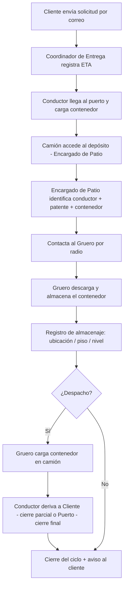
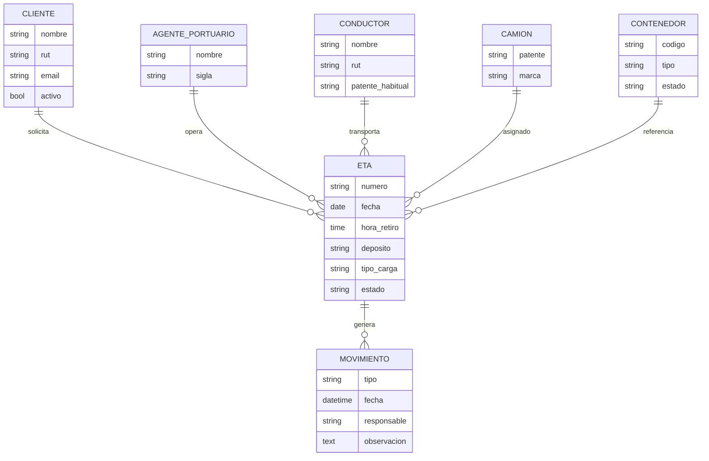
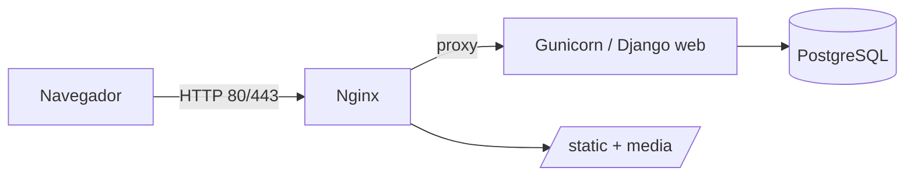
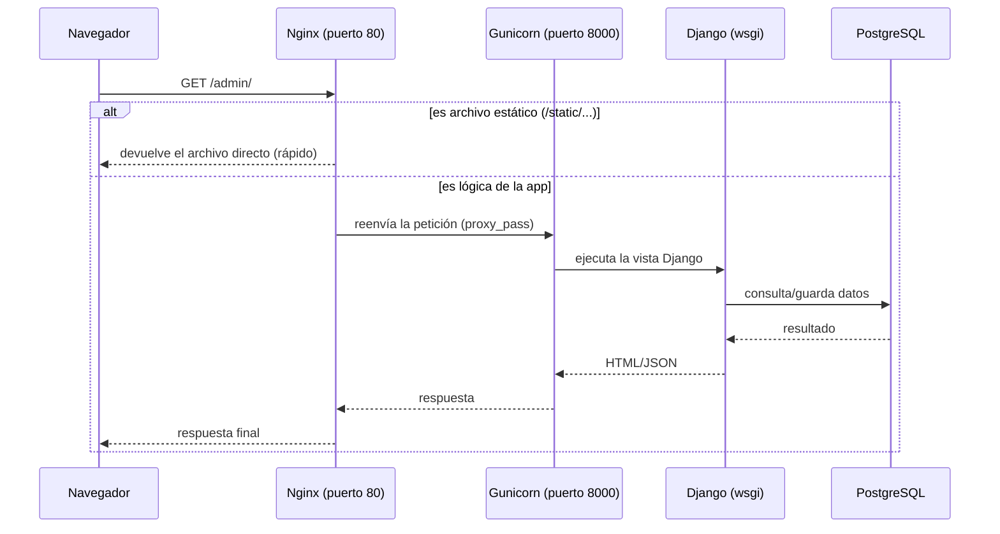
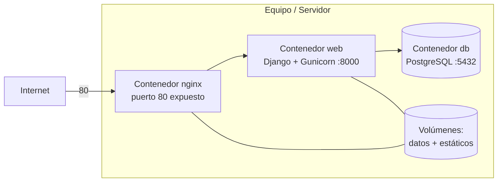

# 🛳️ ESTIBApp — Plan de Proyecto Técnico

> **Sistema de Gestión de Depósito Portuario de Contenedores**
> Retiro, almacenaje, trazabilidad y despacho de contenedores (llenos y vacíos) para operación portuaria.

---

## 📌 Ficha del Proyecto

| Campo | Valor |
| --- | --- |
| **Nombre** | Estibapp |
| **Versión** | 1.0 (producción estable) |
| **Autor** | Alfredo Moya |
| **Rubro** | Logística portuaria / Depósito de contenedores (container depot) |
| **Stack** | Django 5.1.5 · PostgreSQL 16 · Nginx · Docker · Bootstrap 5.3.3 |
| **Estado** | Producción operativa — revisión con stakeholder completada |
| **URL producción** | https://estibapplafragua.cl |
| **Servidor** | DigitalOcean Droplet · IP 209.97.149.174 |

---

## 🏷️ Naming — Nombre del Proyecto

**Nombre elegido:** `Estibapp`
*Combina `estiba` (término marítimo: acomodar/almacenar la carga en un buque o depósito) con el sufijo `app`. Fonéticamente limpio, corto, registrable y directamente asociado al rubro de almacenaje de contenedores.*


---

## 1. Introducción

**Estibapp** es una plataforma web para administrar el ciclo de **retiro, almacenaje y despacho de contenedores** de un depósito portuario que opera entre el **puerto**, el **depósito** (ej. Casablanca) y el **cliente final**.

El objetivo es **reemplazar las planillas Excel/SharePoint compartidas** (retiro, almacenados y entregas) por un sistema único, con **pantallas por perfil**, trazabilidad por solicitud y avisos al cliente.

---

## 2. Contexto del Proceso (según levantamiento)

El depósito opera a partir de **solicitudes que los clientes envían por correo electrónico**, pidiendo contenedores para recibir o retirar carga del puerto.

Todo el flujo se mueve con un documento llamado **ETA**, que contiene:

- Puerto / **Agente portuario** (empresas que licitan los puertos)
- Fecha y **hora de retiro**
- **Patente** del camión y **nombre del conductor**
- **Depósito** del contenedor
- **Código del contenedor**
- **Cliente** que reserva el contenedor
- **Carga** del contenedor (con carga / vacío)

### Flujo operativo (proceso directo)



> **Principio rector — trazar el CONTENEDOR, no "cerrar" la ETA:** el ciclo
> sigue dónde está físicamente el contenedor. Por eso **no existe un estado
> "CERRADO"**; existen **estados de cierre** según dónde sale el contenedor del
> depósito:
> - **Cierre parcial — Despachado a cliente:** el contenedor se entrega al
>   cliente y **volverá al depósito** tras la descarga (retorno → Almacenado).
> - **Cierre final — Despachado a puerto:** el contenedor se **devuelve al
>   puerto**; fin del ciclo del contenedor.

> **Proceso indirecto:** el contenedor va directo de puerto a cliente **sin pasar por el depósito**; solo se **registran datos para trazabilidad** (sin almacenaje físico).

> 💡 **Demurrage ("Demorach"):** el cliente coordina la devolución de contenedores al puerto para evitar cobros por demora. Estibapp debe ayudar a visibilizar plazos.

---

## 3. Problemática

- Dependencia de **3 planillas Excel/SharePoint** (retiro, almacenados, entregas).
- Sin **trazabilidad unificada** por solicitud/cliente.
- Dificultad para saber qué tiene el cliente **en puerto vs. en depósito**.

---

## 4. Solución Propuesta

Sistema web ESTIBAPP  en **Django + PostgreSQL**, con:

- Registro y seguimiento de **ETAs** (solicitudes).
- **Pantallas por perfil** (Coordinador, Encargado de Patio, Administrador).
- **Trazabilidad** del contenedor por estado del ciclo.
- **Recuento** de contenedores en puerto y en depósito.
- **Avisos al cliente** en hitos del proceso.
- Vista **máster** (grilla por solicitud/cliente) para Administrador.
- Base para **modo contingencia local** y exportación CSV.

---

## 5. Roles y Pantallas

| Rol | Responsabilidad | Pantalla |
| --- | --- | --- |
| **Administrador** | Vista máster, informes, configuración, usuarios | Grilla completa de solicitudes/cliente + reportes |
| **Coordinador de Entrega** | Recibe correo del cliente, crea/asigna ETA, coordina con patio | Bandeja de solicitudes y asignación |
| **Encargado de Patio** | Recibe camión, valida conductor/patente, da check al proceso, despacha camiones | Listado operativo + check-in/out |
| **Gruero** *(fase posterior)* | Descarga/carga física (coordinado por radio) | (sin pantalla en MVP1) |

---

## 6. Alcance del MVP 1

✅ **Incluye**
- Gestión de **clientes, conductores, camiones, agentes portuarios**.
- Registro de **ETA** (documento núcleo).
- **Trazabilidad de contenedores** por estado del ciclo.
- **Solo traquear contenedores** (registrar datos), **sin dimensionar espacios**.
- Pantallas por perfil + vista máster administrador.
- Avisos básicos al cliente.

❌ **No incluye (fase posterior)**
- **Dimensionamiento de espacios** (piso, altura, calle, sección, posición, m³).
- Mantención de camiones/contenedores.
- Integraciones externas con sistemas portuarios.

---

## 7. Modelo de Datos (MVP 1)



**Estados del ciclo (ETA):** `SOLICITADO → ASIGNADO → EN_PATIO → ALMACENADO → DESPACHADO_CLIENTE → (retorno) ALMACENADO → DESPACHADO_PUERTO`

> El ciclo **no es lineal**: tras `DESPACHADO_CLIENTE` (cierre parcial) el
> contenedor **retorna** al depósito (`ALMACENADO`) antes del cierre final
> `DESPACHADO_PUERTO`. El estado `ALMACENADO` se reutiliza para el retorno.

**Tipos de movimiento:** `RETIRO · ALMACENAJE · DESPACHO_CLIENTE · RETORNO · DESPACHO_PUERTO`

### 7.1 Cómo modificar estados y tipos de movimiento (configurable)

> Estos valores son la **base del MVP**, pero el equipo puede **agregar, renombrar o quitar**
> estados/tipos sin tocar la lógica. Todo vive en **un solo archivo**.

**📄 Artefacto:** [`apps/operaciones/models.py`](../apps/operaciones/models.py)

**🔧 Para agregar un nuevo estado de ETA** (ejemplo: `EN_TRANSITO`):

1. Abre `apps/operaciones/models.py` y busca la clase `ETA.EstadoCiclo` (≈ línea 150).
2. Agrega **una línea** dentro de la clase:
   ```python
   class EstadoCiclo(models.TextChoices):
       SOLICITADO = "SOLICITADO", "Solicitado"
       ASIGNADO   = "ASIGNADO", "Asignado"
       EN_TRANSITO = "EN_TRANSITO", "En tránsito"   # 👈 NUEVO: VALOR_BD = "VALOR_BD", "Etiqueta visible"
       EN_PATIO   = "EN_PATIO", "En patio"
       # ...
   ```
3. Si quieres que ese estado sea parte del flujo automático, agrégalo como un
   **paso** en la lista `FLUJO_PASOS` (al final del mismo archivo), en el orden
   deseado. Cada paso define `estado`, `mov` (movimiento que se registra al
   entrar, o `None`) y `label`. Un mismo estado puede aparecer en más de un paso
   (ej. `ALMACENADO` se usa para el almacenaje inicial y para el retorno del
   cliente).
4. Genera y aplica la migración:
   ```bash
   docker compose exec web python manage.py makemigrations
   docker compose exec web python manage.py migrate
   ```

**🔧 Para agregar un tipo de movimiento** (ejemplo: `INSPECCION`): mismo procedimiento en la
clase `Movimiento.Tipo`.

> 💡 **Regla de oro:** el formato es siempre `NOMBRE = "valor_guardado_en_BD", "Texto que ve el usuario"`.
> Cambiar solo el **segundo** texto (la etiqueta) **no** requiere migración; cambiar el primero (el valor) **sí**.

---

## 8. Arquitectura Técnica

| Capa | Tecnología |
| --- | --- |
| Frontend | Django Templates + Bootstrap |
| Backend | Django 5.1 (Python **3.13**) |
| Base de Datos | **PostgreSQL 16** |
| Servidor Web | Nginx (reverse proxy) |
| App Server | Gunicorn |
| Contenedores | Docker + Docker Compose |
| Control de versiones | Git / GitHub |

> **¿Por qué Python 3.13?** Django **5.1** soporta oficialmente Python 3.10 → **3.13**. Se usa 3.13 (la última estable). *Nota: Django 5.0 solo llegaba hasta 3.12; por eso el scaffold fija Django 5.1.*
>
> **¿Por qué PostgreSQL 16?** Versión estable y ampliamente probada en producción. Subir a 17 es trivial (solo cambia el tag de imagen en `docker-compose.yml`), pero 16 es la opción conservadora recomendada para el MVP.



---

## 9. Seguridad

**MVP 1 (incluido):**
- Usuarios perfilados por **grupos/roles** Django (Administrador, Coordinador, Encargado de Patio).
- Contraseñas hasheadas (PBKDF2/Argon2).
- Variables sensibles en `.env` (nunca en el repo).
- Bitácora de auditoría de movimientos (cada cambio de estado de la ETA queda registrado).
- Contenedores con **usuario no-root**.

**Fase 2 (planificado):**
- **HTTPS obligatorio** con certificados (Let's Encrypt) una vez desplegado en servidor con dominio.
- 🔐 **Doble factor de autenticación (2FA/MFA)** para **cambios de administrador** y **accesos del personal** (TOTP con app autenticadora, ej. Google Authenticator / `django-otp` + `django-two-factor-auth`).
- **Backups automáticos** de PostgreSQL programados.
- Endurecimiento de cabeceras (HSTS, CSP).

---

## 10. Resiliencia / Contingencia (concepto)

Ante caída del aplicativo, se evalúa un **modo local por pantalla** que:

1. Mantenga la captura de datos del perfil activo.
2. Persista localmente la información.
3. Exporte a **CSV** un informe recuperable.
4. Permita **recargar** la información al aplicativo central al reconectar.

*(Diseño detallado fuera de MVP 1; se deja la arquitectura preparada.)*

---

## 11. Rendimiento (objetivos K6)

| Métrica | Objetivo |
| --- | --- |
| Usuarios concurrentes | 5 → 10 |
| p95 latencia | < 500 ms |
| Tasa de error | < 1% |
| Disponibilidad | > 99% |
| Recuperación ante reinicio | ✔ |
| Restauración de respaldo | ✔ |

---

## 12. Infraestructura y Despliegue (explicado desde cero)

> 📘 El **paso a paso completo** (montar en otro PC + servidor DigitalOcean / Seenode) está en
> [`docs/DESPLIEGUE.md`](DESPLIEGUE.md). Esta sección explica **qué hace cada pieza y por qué**.

### 12.1 ¿Qué problema resuelve esta arquitectura?

Cuando ejecutas `python manage.py runserver`, Django levanta un **servidor de desarrollo**:
cómodo, pero **no apto para producción** (1 sola petición a la vez, sin seguridad, lento).
Para producción se separan responsabilidades en 3 piezas:

| Pieza | Rol (analogía) | Qué hace en Estibapp |
| --- | --- | --- |
| **Nginx** | El *recepcionista* en la puerta | Recibe TODO el tráfico del navegador (puerto 80/443), entrega archivos estáticos (CSS/JS/imágenes) rápido, y reenvía lo demás a Gunicorn. También hará HTTPS. |
| **Gunicorn** | El *motor* que ejecuta la app | Servidor de aplicaciones Python. Corre tu código Django con varios "workers" (procesos) para atender muchas peticiones a la vez. |
| **Django** | El *cerebro* / lógica de negocio | Tu aplicación: vistas, modelos, ETA, reglas. Gunicorn la "enchufa" vía el archivo `config/wsgi.py`. |
| **PostgreSQL** | El *archivo* / memoria | Guarda los datos (clientes, ETAs, movimientos) de forma persistente. |

### 12.2 El flujo de una petición (paso a paso)



### 12.3 Cómo está implementado aquí (Docker Compose)

Todo lo anterior está empaquetado en **3 contenedores** que se levantan con UN comando
(`docker compose up --build`). No necesitas instalar Python, Postgres ni Nginx en el equipo:
Docker lo trae todo.



- **`db`** → imagen `postgres:16`, guarda datos en un volumen (sobrevive a reinicios).
- **`web`** → construye tu código, espera la BD (`wait_for_db`), migra, recolecta estáticos y arranca Gunicorn.
- **`nginx`** → único puerto público (80); sirve estáticos y hace de *reverse proxy* a `web`.

### 12.4 Caminos de despliegue (de menor a mayor)

| Opción | Para qué sirve | Esfuerzo |
| --- | --- | --- |
| **A. Otro PC con Docker** | Demo de operatividad al cliente, probar Nginx | ⭐ Bajo |
| **B. Seenode** (PaaS) | Publicar la app sin administrar el sistema operativo | ⭐⭐ Medio |
| **C. DigitalOcean Droplet** (VPS) | Control total: dominio, HTTPS, backups, infra real | ⭐⭐⭐ Alto (más aprendizaje) |

> Las 3 rutas, con comandos exactos, están detalladas en [`docs/DESPLIEGUE.md`](DESPLIEGUE.md).

---

## 🗺️ Roadmap por Fases (Sprints)

> Cada sprint cierra con un objetivo **demostrable** (MVP incremental).
>
> **Estado de esta entrega:** se ejecutan los **Sprints 0 → 4** (app funcional completa para MVP 1).
> El **Sprint 5** (hardening, backups y K6) se realizará **ya montada en el servidor**.
> El montaje paso a paso está en [`docs/DESPLIEGUE.md`](DESPLIEGUE.md).

### ✅ Sprint 0 — Base técnica *(entregado)*
**Objetivo MVP:** proyecto dockerizado que **levanta y muestra operatividad**.
- Scaffold Django + PostgreSQL + Nginx + Docker Compose.
- Admin Django operativo con modelos del dominio.
- Health check + landing "Estibapp operativo".
- README de levantamiento.

### ✅ Sprint 1 — Identidad y Catálogos *(entregado)*
**Objetivo MVP:** autenticación y datos maestros cargables.
- Login + roles (Administrador, Coordinador, Encargado de Patio).
- CRUD: Clientes, Conductores, Camiones, Agentes Portuarios, Contenedores.

### ✅ Sprint 2 — ETA y Flujo Operativo *(entregado)*
**Objetivo MVP:** registrar una solicitud y moverla por el ciclo.
- Modelo y formulario **ETA**.
- Transiciones de estado `SOLICITADO → … → DESPACHADO_PUERTO`.
- Registro de **movimientos** (retiro/almacenaje/despacho a cliente/retorno/despacho a puerto).

### ✅ Sprint 3 — Pantallas por Perfil + Vista Máster *(entregado)*
**Objetivo MVP:** cada rol opera en su pantalla; admin ve todo.
- Bandeja del Coordinador.
- Tablero operativo del Encargado de Patio (check-in/out).
- Grilla máster del Administrador por solicitud/cliente.

### ✅ Sprint 4 — Trazabilidad, Reportes y Avisos *(entregado)*
**Objetivo MVP:** consolidado puerto vs. depósito + reportes.
- Recuento de contenedores (en puerto / en depósito).
- Reportes (retiro, almacenados, entregas) y exportación CSV.
- Avisos al cliente en hitos (email a consola en MVP).

### ✅ Sprint 5 — Disponibilidad, UX de flujo y producción *(entregado — 27/06/2026)*
**Objetivo:** conductores con disponibilidad real + ciclo ETA refinado + despliegue en producción.
- Modelo `DiaLibre`: registro de días no laborables por conductor.
- Vista mantenedor de conductores con strip de calendario semanal (disponible / día libre / en operación).
- Selector de conductores en formulario ETA dividido en grupos *Disponibles* / *No disponibles ese día*.
- Ciclo ETA: eliminación de "En patio" como opción seleccionable (el backend lo atraviesa automáticamente). "Devuelto a depósito" solo aparece tras `DESPACHADO_CLIENTE`.
- Picker de fecha/hora personalizado con flechas ▲▼ y minutos en intervalos 00/30 (reemplaza `datetime-local` nativo).
- Deploy en DigitalOcean Droplet con dominio https://estibapplafragua.cl.
- Revisión y aprobación con stakeholder. **Tag `v1.0-estable` creado en `main`.**
- Estrategia de ramas: `develop` para trabajo activo, `main` solo para merges aprobados.

### ⏸️ Sprint 6 — Hardening, Backups y K6 *(pendiente)*
**Objetivo:** sistema seguro, respaldado y certificado en carga.
- HTTPS (Let's Encrypt), **2FA admin/personal**, backups automáticos, auditoría.
- Pruebas de carga K6 (5/10 usuarios, p95 < 500 ms).
- Modo contingencia local + CSV (PoC).

### 🔵 Fase 2 — Dimensionamiento y Avanzado
- Mapeo de espacios (piso, altura, calle, sección, posición, m³).
- Disponibilidad de espacios/contenedores.
- Mantención de camiones/contenedores.
- IA: predicción de demanda y alertas.

---

## ✅ Condiciones de Aceptación (MVP 1)

Cada criterio está redactado en formato **Dado / Cuando / Entonces** para poder verificarlo
directamente sobre la app (y servir de base a pruebas automatizadas más adelante).

| # | Criterio (Dado → Cuando → Entonces) | Cómo se verifica |
| --- | --- | --- |
| CA-1 | **Dado** un usuario autenticado con rol válido, **cuando** ingresa credenciales correctas, **entonces** accede al panel correspondiente a su rol. | Login con cada rol redirige a su dashboard. |
| CA-2 | **Dado** el catálogo vacío, **cuando** el usuario crea clientes, conductores, camiones, agentes y contenedores, **entonces** quedan listados, editables y eliminables. | CRUD completo por entidad. |
| CA-3 | **Dado** datos maestros cargados, **cuando** el Coordinador crea una **ETA**, **entonces** queda en estado `SOLICITADO`. | Crear ETA → estado inicial correcto. |
| CA-4 | **Dado** una ETA, **cuando** se avanza el ciclo, **entonces** transita `SOLICITADO → ASIGNADO → EN_PATIO → ALMACENADO → DESPACHADO_CLIENTE → ALMACENADO (retorno) → DESPACHADO_PUERTO` y **cada paso genera un Movimiento** con fecha y responsable. | Detalle de ETA muestra historial de movimientos. |
| CA-5 | **Dado** ETAs en distintos estados, **cuando** se consulta la trazabilidad por cliente, **entonces** se ve el historial completo de cada solicitud. | Vista por cliente / detalle ETA. |
| CA-6 | **Dado** contenedores en operación, **cuando** se abre el panel de recuentos, **entonces** se distingue cuántos están **en puerto** vs **en depósito**. | Dashboard de recuentos. |
| CA-7 | **Dado** un rol, **cuando** navega la app, **entonces** solo ve y opera las pantallas/acciones permitidas para su perfil. | Acceso restringido por grupo. |
| CA-8 | **Dado** el reporte operativo, **cuando** el Administrador exporta retiro/almacenados/entregas, **entonces** descarga un **CSV** válido. | Botón exportar CSV. |
| CA-9 | **Dado** el repositorio, **cuando** se ejecuta `docker compose up --build` en otro equipo, **entonces** la app levanta y responde en `http://localhost`. | Montaje reproducible. |

---

## 12.5 Backup, Rollback y Migración de Datos Reales (SharePoint)

> ⚠️ **Dato crítico de operación.** Cuando el stakeholder entregue su proceso y
> data real desde **SharePoint**, habrá que ajustar modelos/lógica. La prioridad
> absoluta de ese momento es **garantizar rollback**: poder volver a la versión
> previa sin pérdida de datos.

**Antes de migrar (checklist obligatorio):**

1. **Respaldo de base de datos** (PostgreSQL):
   ```bash
   docker compose exec db pg_dump -U $POSTGRES_USER $POSTGRES_DB > backup_$(date +%Y%m%d).sql
   ```
   El volumen `postgres_data` ya persiste los datos; el `pg_dump` es el respaldo
   **portátil** y restaurable.
2. **Respaldo de código** (Git): crear **tag** y **branch** de la versión estable
   actual antes de tocar nada:
   ```bash
   git tag -a v0.1-pre-sharepoint -m "Estado estable antes de integrar data real"
   git checkout -b feature/datos-sharepoint
   ```
3. **Versión etiquetada de la imagen** Docker (para volver al binario exacto):
   ```bash
   docker compose build web
   docker tag estiba_web estiba_web:v0.1-pre-sharepoint
   ```

**La estrategia de rollback se cubre con dos pilares:**
- (a) **Volumen `postgres_data` respaldado** (+ `pg_dump` restaurable con `psql`).
- (b) **Versión etiquetada de la imagen** (`v0.1-pre-sharepoint`) y el **tag de git**.

**Plan de migración versionada (cuando llegue el momento):** se entregará un
**script de backup automatizado** + un set de **migraciones Django reversibles**
(`migrate <app> <migración_anterior>` permite revertir), de modo que cada cambio
de esquema tenga su camino de vuelta. Modelar con Django ayuda: la mayoría de los
ajustes de datos/proceso del stakeholder son **edición de catálogos y listas**
(estados/tipos en `models.py`), no reescritura de la app.

---

## 12.6 Estado actual en producción (notas operativas)

> Qué dejar configurado y qué esperar al pasar de desarrollo (`DEBUG=True`) a
> **producción** (`DEBUG=False`, `DJANGO_ENV=prod`).

| Tema | Comportamiento | Acción / nota |
| --- | --- | --- |
| **Páginas de error amigables (404/403/500)** | Solo se muestran con **`DEBUG=False`** (entorno `prod`). En dev (`DEBUG=True`) Django muestra su página técnica **a propósito**. | Es el comportamiento seguro de **OWASP A05** (no filtrar stack traces). Para verlas, levantar con `DJANGO_ENV=prod`. |
| **Admin Django (`/admin/`)** | El rol de negocio **Administrador ya no es superusuario**. Tras re-ejecutar `seed_demo`, `QA_Administrador` queda sin acceso al master Django. | El admin Django es **solo para el dev**. Crear superusuario propio: `docker compose exec web python manage.py createsuperuser`. |
| **Ubicación de patio ↔ contenedor (ETA)** | El detalle de ETA ya anexa la ubicación física al contenedor. | La idea de **seccionar el almacenaje por ID de contenedor** (trazabilidad de posición) queda anotada como **Fase 2**. |
| **Auditoría / logs** | Toda acción de usuario queda en BD (`RegistroAuditoria`) y en archivos rotados `logs/{app,error,audit,security}.log`. | Revisar `security.log` ante intentos de acceso fallidos. |

---

---

## 13. Control de versiones y puntos estables de producción

### 13.1 Estrategia de ramas

A partir de la versión 1.0 se adopta la siguiente estrategia:

- **`main`**: solo recibe merges desde `develop` cuando el código está probado y aprobado. Es el código que corre en producción.
- **`develop`**: rama de trabajo activa. Todo desarrollo nuevo va aquí primero.
- **Tags**: cada merge a `main` aprobado por el stakeholder se etiqueta con una versión.

**Flujo:**
```
feature → develop → (QA + aprobación) → merge a main → tag
```

Para volver al último punto estable en el servidor:
```bash
cd /opt/estiba-app
git fetch origin
git checkout main
git reset --hard v1.0-estable
docker-compose up -d --no-build
```

### 13.2 Historial de versiones

| Tag | Commit | Fecha | Descripción |
|-----|--------|-------|-------------|
| `v1.0-estable` | `608a263` | 27/06/2026 | Punto estable previo a rama develop. MVP completo, revisado por stakeholder. |
| — | `7c65232` (develop) | 27/06/2026 | Fix: excluir "En patio" y "Devuelto a depósito" de `pasos_futuros` + pre-llenado fecha form ETA. |
| — | `6aeb943` (develop) | 27/06/2026 | Feat: picker fecha/hora con flechas ▲▼ y minutos 00/30. |
| — | `merged → main` | 27/06/2026 | Merge develop → main (picker + fix flujo estados). |

---

## 14. Registro de bugs críticos resueltos

> Historial de errores graves encontrados en producción y sus correcciones. Útil para el equipo técnico y para evitar regresiones.

### BUG-01 — TemplateSyntaxError: "Unclosed block tag" en `eta_detalle.html`
- **Síntoma:** Todas las URLs `/app/etas/xxx/` retornaban 500 con `TemplateSyntaxError`.
- **Causa:** Archivo `eta_detalle.html` truncado — faltaba la sección de Trazabilidad y el `` del bloque `content`.
- **Fix:** Append del contenido faltante vía bash. Commit restaurado.
- **Lección:** Nunca editar templates con `cat >>` en bash WSL; usar solo el editor (Edit tool / VS Code).

### BUG-02 — Commit catastrófico: 109 archivos "eliminados" de git
- **Síntoma:** `git status` mostraba 109 archivos deleted; el servidor quedó sin `docker-compose.yml`.
- **Causa raíz:** Índice git de WSL corrompido tras un `index.lock` de emergencia. Al hacer `git add <archivo_específico>`, el índice solo registraba ese archivo y el commit resultante "borraba" todo lo demás respecto a HEAD.
- **Fix de emergencia:** `git add -A && git commit && git push -f origin main` para restaurar todos los archivos.
- **Fix permanente del índice:** `rm .git/index && git read-tree HEAD` (reconstruye el índice desde HEAD limpiamente).
- **Regla vigente:** Siempre usar `git add -A` desde WSL para este repo. Nunca `git add <archivo_específico>`.
- **Lección para deploy:** Ante historial divergente en el servidor, usar `git fetch && git reset --hard origin/main` en vez de `git pull`.

### BUG-03 — SyntaxError en `models.py`: `unmatched ')'`
- **Síntoma:** Django no arrancaba; `docker-compose logs` mostraba `SyntaxError: unmatched ')'` en línea 468.
- **Causa:** Append anterior con `cat >>` había dejado basura (`dor)`) y un bloque `ESTADOS_CIERRE` duplicado.
- **Fix:** Edit tool para eliminar las líneas con basura. Verificado con `ast.parse()` antes de commitear.

### BUG-04 — TemplateSyntaxError: "Invalid block tag 'endblock'" en línea 437
- **Síntoma:** Misma 500 en todas las ETAs tras deploy de corrección.
- **Causa:** El template tenía un `` duplicado con código JS basura entre ambos (residuo de un `cat >>` previo).
- **Fix:** Edit tool para eliminar líneas 429-437 (el bloque duplicado). Solo quedó el `` correcto.

### BUG-05 — Formulario ETA no hacía submit ("no pasó el click")
- **Síntoma:** Al hacer clic en "Registrar movimiento y avanzar estado", el botón no respondía visiblemente.
- **Causa:** El campo `fecha` (tipo `datetime-local`, required) estaba vacío. La validación del navegador bloqueaba el submit sin mostrar error visible en mobile.
- **Fix:** Reemplazar el `datetime-local` nativo por un picker personalizado con input `date` + flechas ▲▼ para hora/minutos (00/30). La fecha se pre-llena con la hora actual al cargar la página.

### BUG-06 — "Devuelto a depósito" aparecía en estado ALMACENADO
- **Síntoma:** En una ETA en estado ALMACENADO (sin haber despachado al cliente), el selector mostraba la opción "Devuelto a depósito", que no tiene sentido en ese punto del ciclo.
- **Causa:** `pasos_futuros` en la vista incluía todos los pasos con `idx > actual_idx`, sin filtrar por contexto de negocio.
- **Fix:** Filtro en `views.py` → `pasos_futuros`: excluir idx 5 (Devuelto) si `ya_despachado_a_cliente()` retorna False. También se excluyó "En patio" (RETIRO) de todas las opciones, ya que el backend lo atraviesa automáticamente via `while` loop.

---

## 15. Conclusión

**Estibapp** transforma la operación de un depósito portuario basada en planillas en una plataforma trazable, con pantallas por perfil y arquitectura moderna (**Django · PostgreSQL · Docker · Nginx**), enfocada en simplicidad operativa y crecimiento hacia el dimensionamiento de espacios en Fase 2.
