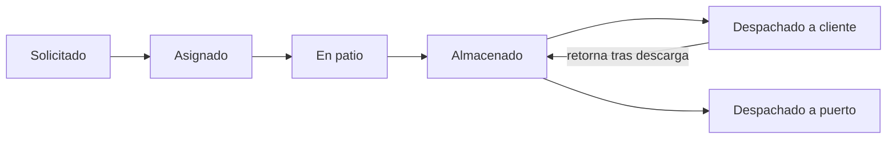

# 📘 MANUAL_USUARIO_ESTIBAPP.md — Manual de Usuario (MVP 1)

Guía de uso de **Estibapp**, el sistema de gestión de depósito portuario.
Este manual está organizado por **rol** y por **tarea**, para que puedas seguirlo
paso a paso mientras pules la versión MVP 1.

---

## 1. ¿Qué hace Estibapp?

Estibapp registra y da trazabilidad al ciclo de un contenedor desde que el
cliente lo solicita hasta que se cierra la operación. El documento central es la
**ETA**, que conecta cliente, agente portuario, contenedor, conductor y camión, y
avanza por una serie de **estados**.

**Ciclo de una ETA:**

El ciclo sigue **dónde está físicamente el contenedor**. No hay un estado
«Cerrado»: hay **dos cierres** según a dónde sale del depósito:

- **Despachado a cliente** (cierre parcial): el contenedor se entrega al cliente
  y **vuelve** al depósito tras la descarga (regresa a *Almacenado*).
- **Despachado a puerto** (cierre final): el contenedor se devuelve al puerto;
  el ciclo termina.

Cada vez que la ETA entra a un estado operativo se registra un **movimiento**
(retiro, almacenaje, despacho a cliente, retorno, despacho a puerto) para
mantener la trazabilidad.

---

## 2. Roles y qué puede hacer cada uno

| Rol | Para qué sirve | Accesos |
|-----|----------------|---------|
| **Administrador** | Configura todo y supervisa. | Todo: catálogos, ETAs, bandeja, patio, recuentos, reportes, admin Django. |
| **Coordinador** | Crea y gestiona solicitudes. | Catálogos (crear/editar), crear y avanzar ETAs, bandeja, recuentos, reportes. |
| **Encargado de Patio** | Mueve contenedores físicamente. | Ver catálogos, ver y avanzar ETAs en patio, recuentos, reportes. |

> Los roles se asignan desde el **Admin de Django** (`/admin/`) agregando el
> usuario al grupo correspondiente. Ver la guía de despliegue, punto 3.6.

---

## 3. Ingreso al sistema

1. Abre `http://<tu-servidor>/login/` (en local: `http://localhost/login/`).
2. Ingresa tu **usuario** y **contraseña**.
3. Llegarás al **Dashboard**, que muestra:
   - Total de ETAs, ETAs abiertas y contenedores en depósito.
   - Las ETAs más recientes.
   - Una acción rápida según tu rol.
4. Para salir, usa el botón **Salir** (arriba a la derecha).

El menú lateral cambia según tu rol: solo verás las secciones a las que tienes acceso.

---

## 4. Tareas paso a paso

### 4.1 Cargar los catálogos base (Administrador / Coordinador)

Antes de crear ETAs conviene tener los datos maestros. En el menú lateral, sección
**Catálogos**:

1. **Clientes** → *Nuevo*: nombre, RUT, email (para avisos), teléfono.
2. **Agentes portuarios** → *Nuevo*: nombre y sigla del agente que opera el puerto.
3. **Contenedores** → *Nuevo*: código, tipo (20' Dry, 40' HC, Reefer, etc.) y estado.
4. **Conductores** → *Nuevo*: nombre, RUT, teléfono.
5. **Camiones** → *Nuevo*: patente y marca.

Cada catálogo permite **Editar** y **Eliminar** desde la lista.

> 💡 El email del cliente se usa para enviarle un aviso cuando su ETA cambia de
> estado. Si lo dejas vacío, simplemente no se envía aviso.

---

### 4.2 Crear una ETA (Administrador / Coordinador)

1. Menú lateral → **ETAs (máster)** → botón **Nueva ETA**
   (o desde el Dashboard → *+ Nueva ETA*).
2. Completa el formulario:
   - **N° ETA**: identificador único de la operación.
   - **Cliente**, **Agente**, **Contenedor**: se eligen de los catálogos.
   - **Conductor** y **Camión**: opcionales (pueden asignarse después).
   - **Depósito**, **Fecha**, **Hora de retiro**.
   - **Tipo de proceso**:
     - *Directo (con almacenaje)*: el contenedor pasa por el depósito.
     - *Indirecto (solo trazabilidad)*: solo se registra el movimiento.
   - **Observaciones**: notas libres.
3. Guarda. La ETA nace en estado **Solicitado** y te lleva a su ficha de detalle.

---

### 4.3 Avanzar una ETA por el ciclo (todos los roles operativos)

En la ficha de la ETA (**ETAs → Ver**):

1. Revisa el panel **Avance del ciclo**: muestra el estado actual.
2. Presiona **Avanzar a «…»** para pasar al siguiente estado.
   - Al avanzar, el sistema registra automáticamente el **movimiento**
     correspondiente (ej. al pasar a *En patio* registra un *Retiro*).
   - Si el cliente tiene email, recibe un aviso del nuevo estado.
3. Cuando la ETA llega a **Despachado a puerto**, el ciclo termina y ya no se puede avanzar.

> El orden del ciclo está definido en el sistema y es configurable por el equipo
> técnico (ver `docs/INFORME_PROYECTO_ESTIBA.md`, sección 7.1).

---

### 4.4 Registrar un movimiento manual

A veces necesitas dejar constancia de un hito sin cambiar el estado:

1. En la ficha de la ETA, panel **Registrar movimiento manual**.
2. Elige el **tipo** (retiro, almacenaje, despacho a cliente, retorno, despacho a puerto), fecha,
   responsable y observación.
3. Presiona **Registrar**. El movimiento aparece en la tabla de **Trazabilidad**.

---

### 4.5 Bandeja del Coordinador (Administrador / Coordinador)

Menú lateral → **Bandeja**. Lista las ETAs que están **en puerto**
(*Solicitado* / *Asignado*) y aún deben gestionarse. Desde aquí entras a cada
ETA para asignarla y ponerla en patio.

---

### 4.6 Tablero de Patio (Administrador / Encargado de Patio)

Menú lateral → **Patio**. Lista los contenedores que están en el flujo de
depósito (*Asignado*, *En patio*, *Almacenado*). El encargado entra a cada ETA y
usa **Avanzar** o **movimiento manual** según lo que ocurre físicamente.

---

### 4.7 Recuentos (todos)

Menú lateral → **Recuentos**. Muestra, por cliente, cuántos contenedores están
**en puerto** y cuántos **en depósito**, además de los totales generales. Útil
para una mirada rápida del inventario.

---

### 4.8 Reportes y exportación a Excel (todos)

Menú lateral → **Reportes**. Tres reportes descargables en **CSV**:

- **Retiros**: ETAs en proceso de retiro desde el puerto.
- **Almacenados**: contenedores actualmente en depósito.
- **Entregas**: ETAs despachadas o devueltas.

Presiona **Exportar CSV**. El archivo se abre directamente en Excel con los
acentos correctos (incluye separador `;` y codificación con BOM).

---

## 5. Buscar y filtrar ETAs

En **ETAs (máster)**:
- Caja de búsqueda: filtra por **N° de ETA**, **nombre de cliente** o **código de contenedor**.
- Desplegable **Estado**: filtra por un estado del ciclo.
- Los resultados se paginan de a 25.

---

## 6. Preguntas frecuentes del usuario

| Pregunta | Respuesta |
|----------|-----------|
| No veo el menú "Catálogos" | Tu rol es *Encargado de Patio*. Solo Administrador y Coordinador editan catálogos. |
| No puedo crear una ETA | Solo Administrador y Coordinador crean ETAs. |
| El botón "Avanzar" no aparece | La ETA ya está **Cerrada** (fin del ciclo). |
| El cliente no recibió el aviso | Verifica que el cliente tenga email cargado. En MVP el correo puede estar en modo consola. |
| ¿Puedo deshacer un avance? | En MVP 1 no hay retroceso automático; usa un movimiento manual para dejar constancia y corrige desde el Admin si es necesario. |

---

## 7. Glosario

- **ETA**: documento central que representa una operación de contenedor.
- **Agente portuario**: empresa que opera/licita el puerto.
- **Movimiento**: hito operativo registrado para trazabilidad.
- **Estado del ciclo**: etapa de la ETA (Solicitado → … → Despachado a puerto).
- **Proceso directo/indirecto**: si el contenedor pasa o no por el depósito.

---

## 8. Checklist para pulir el MVP 1

Usa esta lista para ir validando la app con usuarios reales:

- [ ] Cada rol entra y ve solo su menú.
- [ ] Se cargan los 5 catálogos sin errores.
- [ ] Se crea una ETA completa.
- [ ] La ETA avanza por todos los estados hasta Despachado a puerto.
- [ ] Cada avance genera el movimiento correcto en Trazabilidad.
- [ ] El cliente con email recibe aviso (o se ve en consola).
- [ ] Bandeja y Patio muestran las ETAs esperadas.
- [ ] Recuentos cuadran con lo cargado.
- [ ] Los 3 reportes CSV abren bien en Excel.
- [ ] Búsqueda y filtros de ETAs funcionan.

> Anota aquí los ajustes que pidan los usuarios para priorizarlos en la siguiente
> iteración del MVP.
